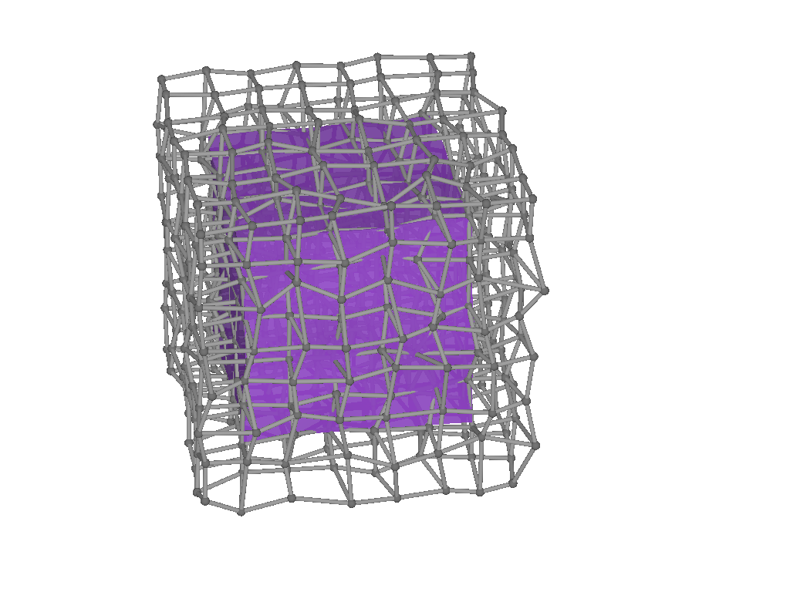

# BasicBSplineExporter

This package supports export `BasicBSpline.BSplineManifold` and `BasicBSpline.CustomBSplineManifold{Dim,Deg,<:StaticVector}` to:
* PNG image (`.png`)
* SVG image (`.png`)
* POV-Ray mesh (`.inc`)

## Installation
```julia
] add BasicBSpline
] add https://github.com/hyrodium/BasicBSplineExporter.jl
```

## First example
```julia
using BasicBSpline
using BasicBSplineExporter
using StaticArrays

p = 2
k = KnotVector(1:8)
P = BSplineSpace{p}(k)
rand_a = [rand(2) for i in 1:dim(P), j in 1:dim(P)]
a = [SVector(2*i-6.5, 2*j-6.5) for i in 1:dim(P), j in 1:dim(P)] + rand_a
M = CustomBSplineManifold(a, (P,P))
k₊=(KnotVector(3.3,4.2),KnotVector(3.8,3.2,5.3))
M′ = refinement(M,k₊=k₊)
save_png("2dim.png", M)
save_png("2dim_refinement.png", M′)
```


## Other examples
Here are some images rendared with POV-Ray.




See `test/runtests.jl` for more examples.
The documentation is still in progress and will be hosted in [BasicBSpline.jl documentation](https://hyrodium.github.io/BasicBSpline.jl/dev/).
